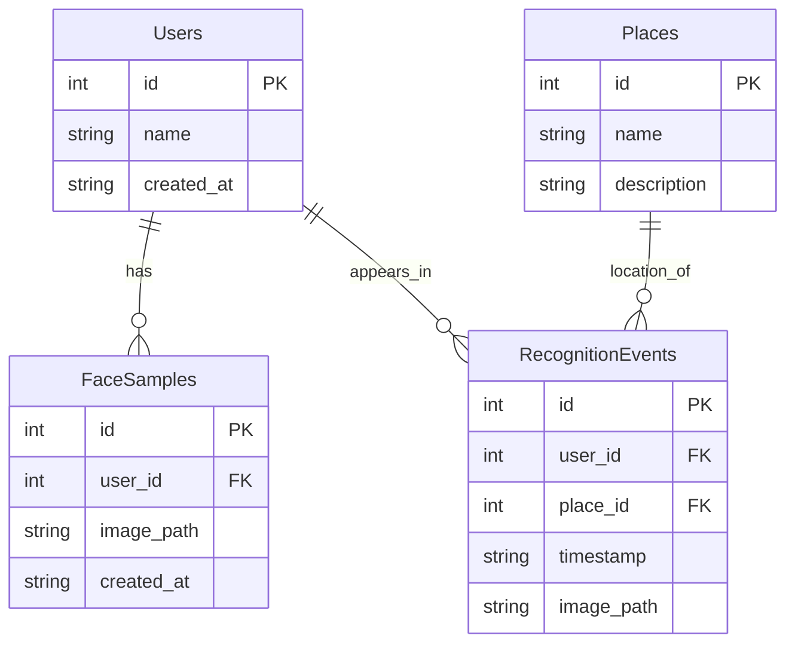
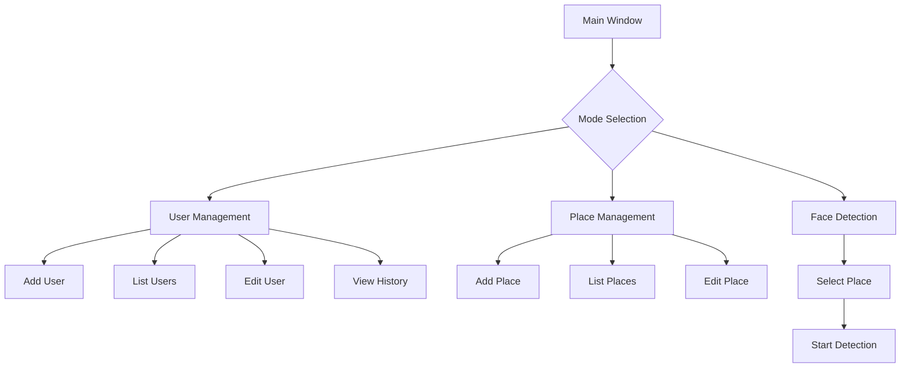

# Enhanced Face Recognition System with Database Integration

## 1. Database Implementation


## 2. Enhanced User Interface


## 3. Implementation Plan

### Phase 1: Database Setup
1. Create SQLite database with tables for:
   - Users (id, name, created_at)
   - FaceSamples (id, user_id, image_path, created_at)
   - Places (id, name, description)
   - RecognitionEvents (id, user_id, place_id, timestamp, image_path)
2. Implement database interaction layer using SQLAlchemy ORM

### Phase 2: Enhanced UI Development
1. Create main window with tabbed interface:
   - User Management tab
   - Place Management tab
   - Face Detection tab
2. User Management features:
   - Add new users with multiple face samples
   - View/edit user information
   - View user recognition history
3. Place Management features:
   - Add/edit places where face detection occurs
   - View detection history by place

### Phase 3: Improved Face Recognition
1. Implement proper face recognition using face embeddings
2. Store face embeddings in database
3. Use stored samples for recognition instead of simple pixel mean
4. Add confidence scoring for recognition results

### Phase 4: Integration
1. Connect UI with database operations
2. Update face recognition system to:
   - Save recognition events with place information
   - Use stored face samples for recognition
   - Display historical data in UI

## 4. Technical Stack
- Database: SQLite with SQLAlchemy ORM
- UI: Tkinter with ttk for modern widgets
- Face Recognition: face_recognition library or dlib
- Image Processing: OpenCV
- Additional Python packages: PIL for image handling

## 5. Directory Structure
```
project/
├── src/
│   ├── database/
│   │   ├── models.py
│   │   └── db_operations.py
│   ├── ui/
│   │   ├── main_window.py
│   │   ├── user_management.py
│   │   └── place_management.py
│   └── recognition/
│       ├── face_detector.py
│       └── face_recognizer.py
├── data/
│   ├── face_samples/
│   └── recognition_events/
└── database.sqlite