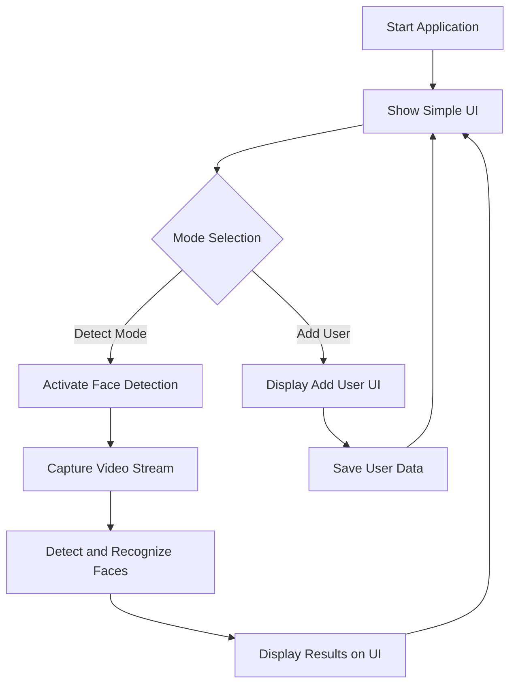

# Face Recognition and Tracking System Plan

## Overview
Develop a real-time face detection and tracking system using Python and OpenCV. The system will use a webcam to capture video in real-time, detect faces using OpenCV's Haar Cascade or an alternative detection model, and track detected faces by drawing bounding boxes. In addition, a simple UI will be added to allow users to switch between "Add User" mode and "Detect Mode".

## Steps Overview

1. **Environment Setup**
   - Install Python and OpenCV.
   - Set up a virtual environment.
   - Confirm the webcam is accessible.

2. **Face Detection and Recognition Implementation**
   - Use OpenCV's Haar Cascades for face detection.
   - Implement dummy face recognition logic.
   - Log detection results and save recognized faces from detection.

3. **Simple UI Implementation**
   - Use a GUI framework (such as Tkinter) for a simple user interface.
   - **Add User Mode:**
     - Allow the user to add a new user, potentially saving their image.
     - Provide necessary input fields and buttons.
   - **Detect Mode:**
     - Start the webcam, perform face detection, apply recognition, and display the results.
     - Switch between modes using UI controls.

4. **User Interface**
   - Design the GUI window with clear options for the two modes.
   - Provide instructions and logs within the UI.
   - Include an "Exit" option for closing the application.

5. **Testing and Iteration**
   - Test the system under various conditions.
   - Debug and refine detection and UI responsiveness.

## Mermaid Diagram

## Dependencies
- Python 3.x
- OpenCV (opencv-python)
- Tkinter (usually included with Python)

## Additional Notes
- Adjust detection and tracking parameters based on performance needs.
- The UI will allow switching easily between adding a new user and detecting faces.
- Consider modularizing the GUI and backend functionalities for maintainability.